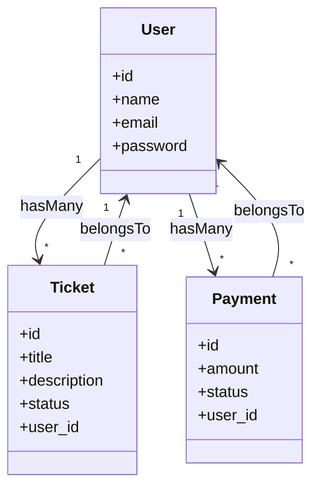
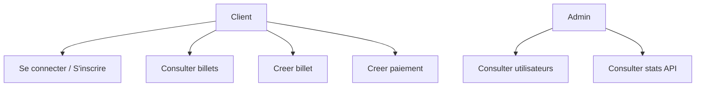

# UML (Mermaid)

## Diagramme De Classes

```mermaid
classDiagram
    class User {
      +id
      +name
      +email
      +password
    }
    class Ticket {
      +id
      +title
      +description
      +status
      +user_id
    }
    class Payment {
      +id
      +amount
      +status
      +user_id
    }

    User "1" --> "*" Ticket : hasMany
    User "1" --> "*" Payment : hasMany
    Ticket "*" --> "1" User : belongsTo
    Payment "*" --> "1" User : belongsTo
```

## Cas D'utilisation (Synthese)

```mermaid
flowchart TD
    Client[Client] --> A[Se connecter / S'inscrire]
    Client --> B[Consulter billets]
    Client --> C[Creer billet]
    Client --> D[Creer paiement]
    Admin[Admin] --> E[Consulter utilisateurs]
    Admin --> F[Consulter stats API]
```
